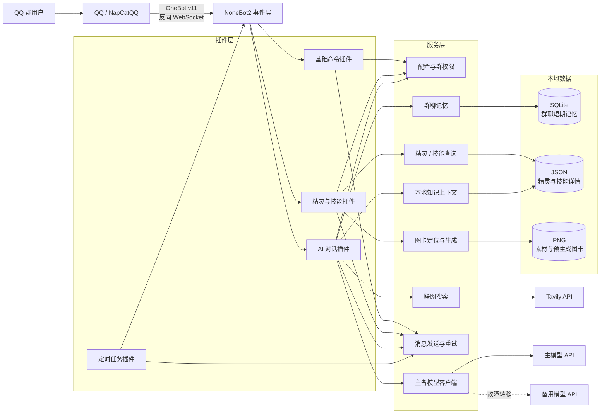

# QQ Group Bot

一个基于 NoneBot2、OneBot v11 和 NapCatQQ 的 QQ 群机器人项目。

项目当前支持基础群命令、《洛克王国：世界》精灵与技能查询、AI 群聊对话、
群聊短期记忆、联网搜索增强回答、本地结构化知识增强，以及定时群消息发送。

> **公开仓库说明：** 本仓库仅包含项目原创代码、文档和测试夹具。第三方数据
> （BWiki 页面数据）、游戏素材（精灵图片、属性图标）及衍生图卡**不随代码分发**。
> 详见 [`DATA_LICENSE.md`](./DATA_LICENSE.md) 和 [`PRIVACY.md`](./PRIVACY.md)。

## 效果截图

> 截图暂未公开。将本仓库部署到 QQ 群后，向机器人发送 `/help`、`/精灵 迪莫` 等命令即可查看实际效果。

## 系统架构



## 功能

| 功能 | 入口 | 说明 |
|---|---|---|
| 帮助与版本 | `/help`、`/version`、`/版本` | 查看可用功能和当前机器人版本 |
| 精灵查询 | `/精灵 迪莫`、`/洛克 迪莫` | 本地精灵数据查询，优先发送静态图卡 |
| 技能查询 | `/技能 闪光` | 查询技能效果及可学习精灵 |
| AI 对话 | `ai 你好` 或 @机器人 | 多模型支持，群聊记忆，本地知识增强 |
| 联网搜索 | 含"今天""搜索"等词的提问 | 可选 Tavily 搜索增强 |
| 定时消息 | 环境变量配置 | 按 Cron 时间向指定群发送消息 |
| 命名提及 | `NAMED_MENTION_REPLACEMENTS` | 定时消息与 AI 回复中的 `@昵称` 替换为真正的 @提及（账号仅从配置读取，不写死在源码） |

### AI 对话能力

- **本地知识增强：** 精灵名称、技能、进化关系、多技能交集等本地结构化数据自动注入模型上下文
- **群聊记忆：** SQLite 存储短期消息，支持"参考最近 N 条""@某人"等自然语言检索
- **主备模型：** 主模型不可用时自动切换到备用 OpenAI 兼容接口
- **联网搜索：** 可选 Tavily 搜索，结果注入模型上下文并要求给出来源

## 快速启动

### 环境要求

- Python 3.11+
- NapCatQQ（含可登录的 QQ 账号）
- OneBot v11 反向 WebSocket 连接
- OpenAI 兼容 API Key（AI 对话）
- Tavily API Key（联网搜索，可选）

### 安装

```powershell
py -3.11 -m venv .venv
.\.venv\Scripts\python -m pip install --upgrade pip
.\.venv\Scripts\python -m pip install -e ".[dev]"
Copy-Item .env.example .env
```

编辑 `.env`，填写 `AI_API_KEY` 等必要配置。

### 配置 NapCat

在 NapCatQQ 的 OneBot v11 配置中添加反向 WebSocket 地址：

```text
ws://127.0.0.1:8081/onebot/v11/ws
```

端口号须与 `.env` 中的 `PORT` 一致。

### 启动

```powershell
.\.venv\Scripts\python bot.py
```

### Windows 一键启动

1. 复制 `startup.example.ps1` 为 `startup.local.ps1`
2. 填写本机的 NapCat 目录、QQ 账号和端口
3. 双击 `一键启动.bat`（或运行 `start_all.ps1`）

脚本会自动关闭已有进程、启动后端和 NapCat，并等待 OneBot 连接。

验证配置：

```powershell
.\start_all.ps1 -ValidateOnly
```

停止：

```powershell
.\stop_all.ps1
```

启动日志写入 `logs/startup/`。

> **安全：** `startup.local.ps1` 包含本机路径和 QQ 账号，**不要提交到仓库**。
> `.gitignore` 已将其排除。

### 离线数据生成

仅当需要使用《洛克王国：世界》本地数据时运行：

```powershell
# 抓取 BWiki 精灵详情
.\.venv\Scripts\python scripts\fetch_roco_pet_detail.py

# 预生成精灵介绍图卡
.\.venv\Scripts\python scripts\generate_roco_pet_cards.py
```

抓取的详情数据、素材和图卡位于 `data/` 目录，**不随公开仓库分发**。

## 测试

```powershell
.\.venv\Scripts\python -m pytest -v
.\venv\Scripts\python -m ruff check .
.\venv\Scripts\python -m ruff format --check .
.\venv\Scripts\python -m pytest --cov=qq_bot --cov-branch --cov-report=term-missing
```

当前自动化测试 388 个，Ruff 静态检查通过；分支覆盖率门槛 `fail_under` 由首次实测基线设定（当前 82%，见 `pyproject.toml`），未经明确评审不得下调。

开发前建议启用 pre-commit（含 ruff 与 Gitleaks 秘密扫描）：

```powershell
.\venv\Scripts\python -m pre_commit install
```

## Docker 部署

后端镜像以非 root 用户运行，容器不包含 NapCat、`.env` 或私有数据：

```powershell
docker compose up -d --build
```

- 数据目录 `data/` 挂载为命名卷 `qq-bot-data`，配置文件通过 `env_file` 注入（不存在时跳过，用环境变量或默认值）
- 健康检查：`GET /healthz`（存活）与 `GET /readyz`（就绪，含 SQLite 迁移与依赖可用性），由镜像内 Python 标准库探测
- 查看状态：`docker compose ps`；日志：`docker compose logs -f backend`
- 本机开发请改用上方“启动”一节的 `python bot.py`（NapCat 需在宿主机或同网络可访问）

## 可靠性语义

- **重试**：AI / Tavily / QQ 发送使用带抖动（jitter）的指数退避，`*_MAX_ATTEMPTS` 含首次调用；超时与连接错误分而治之
- **QQ 发送超时永不重试**：消息可能已被服务端接受，自动重发会导致重复；只有确证发送前失败的连接级错误（如 WebSocket 断开）才重试
- **熔断**：连续瞬时故障达到 `BREAKER_FAILURE_THRESHOLD` 后熔断，恢复窗口后单次探测；熔断器只统计瞬时故障，业务拒绝不计入
- 参数见 `.env.example` 的“可靠性”段

## 公开发布门禁

公开仓库前请运行以下检查：

```powershell
# 项目质量
.\.venv\Scripts\python -m pytest -q
.\.venv\Scripts\python -m ruff check .

# 秘密扫描（需要安装 Gitleaks）
# 注意：gitleaks dir . 会扫描包括 .git 在内的全部文件系统。
# 建议在仅包含公开候选树的目录中执行：
#   mkdir ../qq_bot_scan; Copy-Item src, tests, docs, *.md, *.ps1, *.toml ../qq_bot_scan/
#   gitleaks dir --redact --no-banner ../qq_bot_scan
#   Remove-Item -Recurse ../qq_bot_scan
# 全历史扫描
# gitleaks git --redact --no-banner .
```

Gitleaks 安装参考：<https://gitleaks.io>。

详细发布检查清单见
[`docs/public-release/release-checklist.md`](./docs/public-release/release-checklist.md)。

## 许可与隐私

| 文档 | 说明 |
|---|---|
| [`LICENSE`](./LICENSE) | 项目原创代码的 MIT 许可证 |
| [`DATA_LICENSE.md`](./DATA_LICENSE.md) | 第三方数据、素材和图卡的权利说明 |
| [`PRIVACY.md`](./PRIVACY.md) | 聊天数据处理、存储和外部传输说明 |
| [`CHANGELOG.md`](./CHANGELOG.md) | 版本变更记录 |

## 技术栈

- **框架：** NoneBot2、OneBot v11、NapCatQQ、FastAPI driver
- **AI：** OpenAI 兼容 Chat Completions API（主备切换）
- **搜索：** Tavily Search API
- **数据：** SQLite、JSON、Pillow 图卡渲染
- **工程：** pytest（含覆盖率门槛）、Ruff、pre-commit、Gitleaks、pydantic-settings、httpx、tenacity
- **部署：** Docker / Docker Compose（非 root 后端镜像）、Python 3.11+（CI 验证 3.11 / 3.12）
