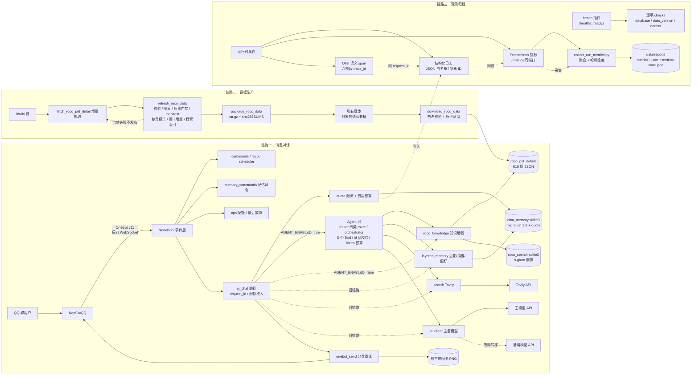

# QQ Group Bot

[](https://github.com/2321Robin/qq_bot/actions/workflows/ci.yml)

一个基于 NoneBot2、OneBot v11 和 NapCatQQ 的 QQ 群机器人项目。

项目当前支持基础群命令、《洛克王国：世界》精灵与技能查询、AI 群聊对话、
群聊短期记忆、联网搜索增强回答、本地结构化知识增强，以及定时群消息发送。

> **公开仓库说明：** 本仓库仅包含项目原创代码、文档和测试夹具。第三方数据
> （BWiki 页面数据）、游戏素材（精灵图片、属性图标）及衍生图卡**不随代码分发**。
> 详见 [`DATA_LICENSE.md`](./DATA_LICENSE.md) 和 [`PRIVACY.md`](./PRIVACY.md)。

## 效果截图

> 截图暂未公开。将本仓库部署到 QQ 群后，向机器人发送 `/help`、`/精灵 迪莫` 等命令即可查看实际效果。

计划收录（部署并完成脱敏核对后更新，见 `docs/public-release/screenshot-redaction-checklist.md`）：

| 截图 | 内容 | 状态 |
|---|---|---|
| `docs/assets/screenshots/01-help-command.png` | `/help` 帮助命令 | 待用户提供 |
| `docs/assets/screenshots/02-pet-card.png` | `/精灵` 图卡 | 待用户提供 |
| `docs/assets/screenshots/03-grounded-ai-answer.png` | AI 回答（含引用来源） | 待用户提供 |

## 系统架构

三条独立链路：**消息对话**（QQ ↔ 机器人）、**数据生产**（BWiki → 校验 → 分发）与**观测归档**（日志/指标/链路 → 报告）。



## 功能

| 功能 | 入口 | 说明 |
|---|---|---|
| 帮助与版本 | `/help`、`/version`、`/版本` | 查看可用功能和当前机器人版本 |
| 精灵查询 | `/精灵 迪莫`、`/洛克 迪莫` | 本地精灵数据查询，优先发送静态图卡 |
| 技能查询 | `/技能 闪光` | 查询技能效果及可学习精灵 |
| AI 对话 | `ai 你好` 或 @机器人 | 多模型支持，群聊记忆，本地知识增强；`AGENT_ENABLED=true` 时走结构化 Tool Calling 链路 |
| 记忆命令 | `/记忆保存`、`/记忆查看`、`/记忆删除`、`/记忆关闭` | 显式保存/查看/删除/关闭长期偏好与分层记忆（阶段 2） |
| 联网搜索 | 含"今天""搜索"等词的提问 | 可选 Tavily 搜索增强 |
| 定时消息 | 环境变量配置 | 按 Cron 时间向指定群发送消息 |
| 命名提及 | `NAMED_MENTION_REPLACEMENTS` | 定时消息与 AI 回复中的 `@昵称` 替换为真正的 @提及（账号仅从配置读取，不写死在源码） |
| 配额与预算（阶段 4） | `QUOTA_ENABLED` 等 | 按群滑动窗口限流与每日费用上限（`actual` 强制、`estimated/unknown` 只记录）；`/配额`、`/最近故障` 管理员命令（按 `ADMIN_USER_IDS` 鉴权） |

### AI 对话能力

- **本地知识增强：** 精灵名称、技能、进化关系、多技能交集等本地结构化数据自动注入模型上下文
- **群聊记忆：** SQLite 存储短期消息，支持"参考最近 N 条""@某人"等自然语言检索
- **主备模型：** 主模型不可用时自动切换到备用 OpenAI 兼容接口
- **联网搜索：** 可选 Tavily 搜索，结果注入模型上下文并要求给出来源

### Agent 模式（阶段 2，`AGENT_ENABLED=true`）

开启后自然语言提问先经 Router 分类为四类 route：`local_knowledge`（本地知识）、`web_search`（联网搜索）、`chat_memory`（群聊记忆）、`direct_chat`（普通对话）；低置信度或能力不足时直接澄清回复，不调用模型。Agent 初始注册 5 个 Tool：

- `lookup_pet` / `find_skill_intersection` / `get_evolution_routes`（本地图鉴，`L` 证据）
- `search_web`（Tavily，`W` 证据）
- `search_chat_memory`（群聊记忆，`M` 证据）

限制与安全边界：

- **轮次/调用/截止：** `AGENT_MAX_ROUNDS`（默认 3）、`AGENT_MAX_TOOL_CALLS`（默认 4）、`AGENT_TOOLS_PER_ROUND`（默认 2）、`AGENT_DEADLINE_SECONDS`（默认 60，超时即中止并回退安全回复）。
- **Token 预算按来源分配：** context window 内按 `AGENT_BUDGET_*_RATIO` 为本地图鉴/搜索/近期消息/短期摘要预留配额，未用配额让给高优先来源；预算不足时在调用模型前明确失败（`BUDGET_INSUFFICIENT`）。
- **搜索内容不可信：** Tavily 返回的网页摘录视为不可信数据；只作为上下文引用，**不会二次抓取**结果 URL，最终回答只显示 Tool 实际返回的 URL。
- **记忆分层：** 近期消息（自动）、短期摘要（`MEMORY_SUMMARY_ENABLED=true` 时对过期消息生成，不延长保留期）、长期偏好（仅 `/记忆保存` 显式写入）。删除范围：`/记忆删除` 删除该用户偏好，`/记忆删除 全部` 或 `/记忆关闭` 删除该用户全部相关数据（自身消息、AI 回复、偏好与关联摘要）。
- **回滚开关：** `AGENT_ENABLED=false`（默认）时完全保持阶段 1 旧链路，Agent 代码不参与对话处理。
- 语义 verifier（`AI_SEMANTIC_VERIFIER_ENABLED`）在正式评测中必须开启；确定性 grounding 检查始终运行、不可关闭。

## 快速启动

### 环境要求

- Python 3.11+
- NapCatQQ（含可登录的 QQ 账号）
- OneBot v11 反向 WebSocket 连接
- OpenAI 兼容 API Key（AI 对话）
- Tavily API Key（联网搜索，可选）

### 安装

```powershell
py -3.11 -m venv .venv
.\.venv\Scripts\python -m pip install --upgrade pip
.\.venv\Scripts\python -m pip install -e ".[dev]"
Copy-Item .env.example .env
```

编辑 `.env`，填写 `AI_API_KEY` 等必要配置。

### 配置 NapCat

在 NapCatQQ 的 OneBot v11 配置中添加反向 WebSocket 地址：

```text
ws://127.0.0.1:8081/onebot/v11/ws
```

端口号须与 `.env` 中的 `PORT` 一致。

### 启动

```powershell
.\.venv\Scripts\python bot.py
```

### Windows 一键启动

1. 复制 `startup.example.ps1` 为 `startup.local.ps1`
2. 填写本机的 NapCat 目录、QQ 账号和端口
3. 双击 `一键启动.bat`（或运行 `start_all.ps1`）

脚本会自动关闭已有进程、启动后端和 NapCat，并等待 OneBot 连接。

验证配置：

```powershell
.\start_all.ps1 -ValidateOnly
```

停止：

```powershell
.\stop_all.ps1
```

启动日志写入 `logs/startup/`。

> **安全：** `startup.local.ps1` 包含本机路径和 QQ 账号，**不要提交到仓库**。
> `.gitignore` 已将其排除。

### 离线数据生成

仅当需要使用《洛克王国：世界》本地数据时运行：

```powershell
# 抓取 BWiki 精灵详情
.\.venv\Scripts\python scripts\fetch_roco_pet_detail.py

# 预生成精灵介绍图卡
.\.venv\Scripts\python scripts\generate_roco_pet_cards.py
```

抓取的详情数据、素材和图卡位于 `data/` 目录，**不随公开仓库分发**。

### 数据管道（阶段 3）

刷新、校验、门禁、差异报告与发布由 `scripts/refresh_roco_data.py` 编排（也提供 `refresh-roco-data` 控制台命令）：

```powershell
# 先在夹具数据上离线彩排（不写正式目录/manifest/索引，仍产出差异报告）
.\.venv\Scripts\python scripts\refresh_roco_data.py --offline --dry-run `
  --details-dir tests/fixtures/data_pipeline/details `
  --manifest-dir tests/fixtures/data_pipeline/manifests `
  --reports-dir tests/fixtures/data_pipeline/reports `
  --quarantine-dir tests/fixtures/data_pipeline/quarantine

# 真实刷新（增量抓取 → 校验 → 质量门禁 → 差异报告 → 发布 → 图卡增量 → 搜索索引）
.\\.venv\\Scripts\\python scripts\\refresh_roco_data.py
# 并发抓取（--fetch-workers N，每个 worker 独立按 --delay-seconds 限流）与失败续抓：
#   全量失败后（如源站反爬），用最新报告只重抓失败页，保留上次成功产物：
#   .\\.venv\\Scripts\\python scripts\\refresh_roco_data.py --delay-seconds 2 --fetch-workers 2
#   .\\.venv\\Scripts\\python scripts\\refresh_roco_data.py --retry-errors-from data/reports/refresh-<时间戳>.json
# 抓取进度以 [fetch] N/M (P%) 行实时输出；门禁失败不发布（退出码 1）。

# 只校验 manifest 与磁盘一致性（不一致退出码 1）
.\\.venv\\Scripts\\python scripts\\refresh_roco_data.py --offline --verify-only
```

要点：

- **校验与隔离**：非法详情文件移入 `data/quarantine/`，同时写入 `{名称}.error.json` 记录失败原因；隔离文件不进 manifest、门禁、图卡与索引。
- **Manifest**：`data/manifests/latest.json` 记录逐文件 sha256、`dataset_hash` 与门禁检查值；每次刷新开始时旧值轮转为 `previous.json`。`--dry-run` 不写任何 manifest。
- **差异报告**：每次刷新产出 `data/reports/refresh-<时间戳>.json`（机器可读，含 `gate_failed`、门禁明细、隔离清单）与同名 `.md`（人读摘要）。
- **质量门禁**：记录数下限、净删除、编号断档、六维完整率、总种族值、悬空进化边、技能键缺失率、隔离目录非空，阈值全部可在 `.env`/环境变量配置，并写入报告与 manifest。门禁失败不发布，退出码 1。
- **图卡增量**：`--change-set` 模式只重绘新增/修改及其进化链引用记录（`generate_roco_pet_cards.py --change-set data/manifests/change_set.json`）。
- **搜索索引**：刷新后重建 `data/roco_search.sqlite3`（n-gram 倒排）；运行时查询命中索引候选池，索引缺失/损坏时回退全量扫描（行为与阶段 2 一致）。
- **运行时缓存**：`get_pet_records`/`get_skill_records` 为进程内缓存；数据更新后需重启，或调用 `clear_record_caches()` 热更新（刷新流程本身不会清缓存）。

**分发命令与许可边界（私有）**：

```powershell
# 打包：data/dist/roco-data-<dataset_hash8>.tar.gz（详情 + latest.json + sha256SUMS.txt）
.\.venv\Scripts\python scripts\package_roco_data.py

# 下载并校验安装：--base-url 必填、无内置公开 URL（数据不可公开再分发）
.\.venv\Scripts\python scripts\download_roco_data.py --base-url <私有基址> --dataset-hash <dataset_hash>
```

数据为私有许可（见 `DATA_LICENSE.md` 第 6 节）；`download-roco-data` 校验 sha256SUMS 逐文件与 `dataset_hash`，校验失败不落盘；下载经 `data/.cache/` 按哈希缓存，缓存损坏自动忽略重下。

**分发载体评估结论**：当前规模（详情约 7.1 MB；含素材与图卡约 258 MB）与 NC/私有许可边界下，采用**对象存储私有桶**为推荐载体（详情级规模成本约 $0.01/月量级）；不使用 Git LFS 或公开 GitHub Release（LFS 改变存储而非许可，公开 Release 直接违反许可边界）；自托管载体的运维成本高于其收益，不采用。命令接口与载体解耦，切换载体只需更换 `--base-url`。

## 测试与评测

```powershell
.\\.venv\Scripts\python -m pytest -v
.\\venv\Scripts\python -m ruff check .
.\\venv\Scripts\python -m ruff format --check .
.\\venv\Scripts\python -m pytest --cov=qq_bot --cov-branch --cov-report=term-missing
```

当前自动化测试 **889 个**（2026-08-03 硬化收尾后实测），Ruff 静态检查通过；分支覆盖率门槛 `fail_under` 由首次实测基线设定（当前 82%，见 `pyproject.toml`），未经明确评审不得下调。

开发前建议启用 pre-commit（含 ruff 与 Gitleaks 秘密扫描）：

```powershell
.\\venv\Scripts\python -m pre_commit install
```

### 评测（阶段 2）

离线评测在 CI 中强制执行（冻结数据集 + manifest 哈希门禁，篡改数据集即失败）：

```powershell
# 数据集校验
.\\.venv\Scripts\python scripts/run_agent_eval.py --mode validate --dataset evals/cases/roco_agent_v1.jsonl
# 离线评测（冻结 test split，无网络/无 API Key）
.\\.venv\Scripts\python scripts/run_agent_eval.py --mode offline --dataset evals/cases/roco_agent_v1.jsonl --split test
# 真实 Provider 基准（需 AGENT_EVAL_LIVE=1 + AI_API_KEY/AI_MODEL；无 Provider 时拒绝运行）
.\\.venv\Scripts\python scripts/run_agent_eval.py --mode live --dataset evals/cases/roco_agent_v1.jsonl --split test
```

Live 报告写入 `evals/reports/live-<split>.json`（已 gitignore，不随仓库分发；结构见 `evals/reports/live-report.template.json`）。报告包含 dataset/model/日期/样本数/失败数与估算边界，且不包含 API Key、完整私有 prompt、原始聊天或 Provider header。最新脱敏报告由部署者在本地运行后自行归档——**仓库不宣称任何评测目标已达到**；质量门槛（tool selection ≥ 90%、事实正确率 ≥ 85%、citation provenance = 100%、refusal recall ≥ 90%、编造率 ≤ 5%）未达标时报告如实呈现并返回非零退出码。

### 评测结果

| 模式 | 数据集 | 样本 | 路由准确率 | 工具选择精确匹配 | 事实准确率 | 拒答召回 | 编造失败 | 失败数 | 成本 |
|---|---|---|---|---|---|---|---|---|---|
| 离线（冻结 test split，无网络） | `roco_agent_v1.jsonl`（manifest 哈希门禁） | 84 | 100% | 100% | 100% | 100% | 0 | 0 | 未发生调用 |
| live（glm-4-flash，2026-08-03） | 同上 | 84 | 29.8%（Agent） | 23.8% | 54.8%（Agent）/ 53.6%（legacy） | 0%（Agent）/ 11.8%（legacy） | 0（两种模式均无编造失败用例） | 316（Agent）/ 348（legacy） | 0 元（免费模型，`usage` 未上报） |

- 离线行：确定性链路全部指标 100%（`code_revision ae23cf2`，2026-08-01）；当前 HEAD 的离线重跑在 CI 每次 push 强制执行，报告不落库。
- live 行：**门禁未达标**（`EVAL_EXIT=1`，失败项：tool_selection ≥ 90%、fact_accuracy ≥ 85%、refusal_recall ≥ 90%；citation_provenance = 100% 与 fabrication ≤ 5% 通过），如实记录；`code_revision 8de439e`、`dataset_hash 49246021…`、provider `glm-4-flash`（免费）。人工复核表（45 条失败样本）待部署者填写后归档：`evals/reports/live-human-review-20260803-050122.md`。
- 成本按 `evals/pricing.json` 计价；免费模型且 usage 未上报时标记 `unknown`，不填推测数字。

`evals/pricing.json` 为可选价格表（参考 `evals/pricing.example.json`）；缺失或模型不在表中时，成本标记 `estimated`/`unknown`，不填入推测数字。

## Docker 部署

后端镜像以非 root 用户运行，容器不包含 NapCat、`.env` 或私有数据：

```powershell
docker compose up -d --build
```

- 数据目录 `data/` 挂载为命名卷 `qq-bot-data`，配置文件通过 `env_file` 注入（不存在时跳过，用环境变量或默认值）
- 健康检查：`GET /healthz`（进程存活）与 `GET /readyz`（就绪，含 `checks` 逐项检查：`database` SQLite 探针 + schema 版本、`data_version` 阶段 3 manifest、`onebot` 连接状态），由镜像内 Python 标准库探测；`READYZ_REQUIRE_DATA`/`READYZ_REQUIRE_ONEBOT` 可配置哪些检查阻断就绪
- 指标：`GET /metrics` 与健康端点同端口（默认 8081），Prometheus 文本格式；由外部 Prometheus **按需抓取** `http://<host>:8081/metrics`，仓库不内置采集服务，Docker/Compose 不新增端口
- 查看状态：`docker compose ps`；日志：`docker compose logs -f backend`
- 本机开发请改用上方“启动”一节的 `python bot.py`（NapCat 需在宿主机或同网络可访问）

## 可靠性语义

- **重试**：AI / Tavily / QQ 发送使用带抖动（jitter）的指数退避，`*_MAX_ATTEMPTS` 含首次调用；超时与连接错误分而治之
- **QQ 发送超时永不重试**：消息可能已被服务端接受，自动重发会导致重复；只有确证发送前失败的连接级错误（如 WebSocket 断开）才重试
- **熔断**：连续瞬时故障达到 `BREAKER_FAILURE_THRESHOLD` 后熔断，恢复窗口后单次探测；熔断器只统计瞬时故障，业务拒绝不计入
- 参数见 `.env.example` 的“可靠性”段

## 可观测性（阶段 4）

### 结构化日志

`LOG_FORMAT=json` 时输出单行 JSON 日志，键集固定白名单（`ts/level/logger/event/message/request_id/group_hash/user_hash/provider/tool/duration_ms` 等）；每条消息有唯一 `request_id` 贯穿处理链，span 的 `trace_id` 等于该 `request_id`。群号/用户号在日志、指标、span 中一律以不可逆哈希（sha256 截断 16 位 hex）出现；消息正文、prompt 原文、API Key、草稿不进入任何观测产物。`LOG_LEVEL` 可配置。

### 指标

`GET /metrics` 暴露 Prometheus 文本指标（同端口，见 Docker 一节）：消息量 `qq_bot_messages_total{kind}`、命令量 `qq_bot_commands_total{command}`、错误率 `qq_bot_errors_total{component,category}`、AI/搜索延迟直方图、主备切换 `qq_bot_provider_fallback_total`、重试 `qq_bot_retry_total{dependency}`、Token 与估算成本（诚实标记 `actual/estimated/unknown`）、breaker 状态与转换、发送/Agent/路由结果、配额拒绝 `qq_bot_quota_denied_total{scope_type,reason}`、六阶段 span 耗时。`METRICS_ENABLED=false` 时端点 404 且埋点零开销。

### 追踪

每条 AI 消息产生 span 树（消息接收、记忆检索、知识工具、搜索、模型调用、QQ 发送六阶段；Agent 路径另有路由分类与 `agent.loop`），共享 `trace_id`，父子嵌套；span 只承载耗时与状态（失败带 `category`），路由决策内容继续由阶段 2 `RouteTrace` 承载。`TRACE_ENABLED=false` 时 span 为空操作。

### 配额与预算

- `QUOTA_ENABLED`（默认 true）开启入口层配额：按群滑动窗口 `QUOTA_RATE_LIMIT_PER_MINUTE` 次/分钟（0 = 关闭），每日费用上限全局 `QUOTA_DAILY_COST_LIMIT_USD` 与每群 `QUOTA_GROUP_DAILY_COST_LIMIT_USD`（0 = 关闭）。
- 只有 Provider 返回的 `actual` 成本计入强制预算；`estimated`/`unknown` 只记录与展示，不拒绝调用。阶段 2 单请求上限（轮次/调用/截止/Token 预算）不变。
- 计数与事件持久化于 SQLite（migration 3：`quota_usage`/`quota_events`），重启不丢失当日计数。
- 超限时：返回稳定用户提示、不调用模型、递增 `qq_bot_quota_denied_total`、写入 `quota_events`；显式命令（`/help`、`/精灵`、`/技能` 等）不受限流影响。
- 管理员命令 `/配额` 与 `/最近故障`（按 `ADMIN_USER_IDS` 鉴权，非管理员拒绝并记录）：查看每群当日请求数、Token 用量、已用费用与上限，以及最近故障（时间/类别/原因）。

### 健康检查

- `/healthz`：进程存活，不访问任何依赖。
- `/readyz`：200 需同时满足 runtime 就绪、`database`（SQLite 探针 + schema 版本等于 `SUPPORTED_SCHEMA_VERSION`）、数据目录存在时 `data_version`（`data/manifests/latest.json` 可解析且 schema 受支持）、以及 `READYZ_REQUIRE_ONEBOT=true` 时的 OneBot 连接；响应体含逐项 `checks` 对象，无环境变量/路径/账号/群号。

### 压测与容量决策

```powershell
# 离线合成压测（fake Provider + 假搜索 + 临时 SQLite + fixture 数据 + fake bot，不触网）
.\venv\Scripts\python scripts\run_load_test.py --cases 100 --concurrency 4
# 只打印不写报告
.\venv\Scripts\python scripts\run_load_test.py --cases 20 --concurrency 4 --no-write
```

报告写入 `data/reports/loadtest-<时间戳>.{json,md}`（Pydantic 固定 schema：五类场景 `local_knowledge/web_search/chat_memory/direct_chat/mixed` 的请求数、成功/失败、端到端 P50/P95、吞吐量、分阶段 P50/P95、环境摘要、结论与免责声明）。报告头部声明合成负载，不代表真实线上延迟/SLO。

**容量结论：当前规模（单实例、本地 SQLite、无跨进程状态）不引入 PostgreSQL/Redis。** 触发重新评估的条件（写入报告）：端到端 P95 超过目标（默认 5s，可配置）且瓶颈定位为 SQLite 写入竞争；出现多实例/多进程部署需求；出现跨进程共享限流状态需求。

### 运行指标采集

```powershell
# 从运行实例抓取 /metrics + 聚合 chat_memory.sqlite3，落盘 data/reports/metrics-<日期>.json
.\venv\Scripts\python scripts\collect_run_metrics.py
# 只打印不落盘（--no-write 也不写 metrics-state.json）
.\venv\Scripts\python scripts\collect_run_metrics.py --no-write
# 读最近导出的 metrics 文本（实例已停止时）
.\venv\Scripts\python scripts\collect_run_metrics.py --metrics-file metrics.txt
```

采集输出（Pydantic 固定 schema，`schema_version=1`）：运行天数（自 `metrics-state.json` 的 `first_seen` 累计）、群数/用户数/消息量（只输出计数与 sha256 哈希维度，不落原始号）、AI 请求量与端到端 P50/P95（直方图观测）、命令分布、主备切换/重试/错误、搜索触发（无结果率无对应指标，如实标 `not_observed`）、Token 与成本、配额命中（`qq_bot_quota_denied_total` + `quota_usage`/`quota_events` 聚合）。无观测字段一律标 `not_observed`，禁止填 0 冒充。

> **诚实验收边界：** 采集通道可用 + 首采落盘即满足本项验收；「运行 N 天后的数值」属持续采集产物，不承诺当天可得。首采于 2026-08-03 对副本运行实例完成（`data/reports/metrics-20260803.json`，`uptime_days=0`）。

## 公开发布门禁

公开仓库前请运行以下检查：

```powershell
# 项目质量
.\.venv\Scripts\python -m pytest -q
.\.venv\Scripts\python -m ruff check .

# 秘密扫描（需要安装 Gitleaks）
# 注意：gitleaks dir . 会扫描包括 .git 在内的全部文件系统。
# 建议在仅包含公开候选树的目录中执行：
#   mkdir ../qq_bot_scan; Copy-Item src, tests, docs, *.md, *.ps1, *.toml ../qq_bot_scan/
#   gitleaks dir --redact --no-banner ../qq_bot_scan
#   Remove-Item -Recurse ../qq_bot_scan
# 全历史扫描
# gitleaks git --redact --no-banner .
```

Gitleaks 安装参考：<https://gitleaks.io>。

详细发布检查清单见
[`docs/public-release/release-checklist.md`](./docs/public-release/release-checklist.md)。

## 许可与隐私

| 文档 | 说明 |
|---|---|
| [`LICENSE`](./LICENSE) | 项目原创代码的 MIT 许可证 |
| [`DATA_LICENSE.md`](./DATA_LICENSE.md) | 第三方数据、素材和图卡的权利说明 |
| [`PRIVACY.md`](./PRIVACY.md) | 聊天数据处理、存储和外部传输说明 |
| [`CHANGELOG.md`](./CHANGELOG.md) | 版本变更记录 |

## 技术栈

- **框架：** NoneBot2、OneBot v11、NapCatQQ、FastAPI driver
- **AI：** OpenAI 兼容 Chat Completions API（主备切换）
- **搜索：** Tavily Search API
- **数据：** SQLite、JSON、Pillow 图卡渲染
- **工程：** pytest（含覆盖率门槛）、Ruff、pre-commit、Gitleaks、pydantic-settings、httpx、tenacity、prometheus-client
- **部署：** Docker / Docker Compose（非 root 后端镜像）、Python 3.11+（CI 验证 3.11 / 3.12）
